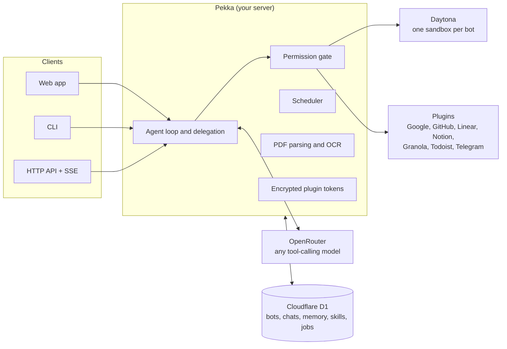

<p align="center">
  
</p>

<h1 align="center">Pekka</h1>

<p align="center">
  <strong>An open-source AI workspace where bots do the work on their own cloud computers.</strong>
</p>

<p align="center">
  <a href="LICENSE"></a>
  
  
  
</p>

<p align="center">
  <a href="#quick-start">Quick start</a> ·
  <a href="#features">Features</a> ·
  <a href="#usage">Usage</a> ·
  <a href="#plugins">Plugins</a> ·
  <a href="#configuration">Configuration</a> ·
  <a href="#contributing">Contributing</a>
</p>

---

Pekka gives each of your bots a persistent Linux sandbox, a memory, and a set of skills, then lets them run commands, write files, and work with your connected apps until a job is done. A chat assistant tells you what to do. A Pekka bot does it.

Every account starts with **Chief of Staff**. You tell it what you need, it splits the work between your specialist bots, runs them side by side, and brings their answers back.

```text
You:    Get me ready for Thursday's renewal call with Acme.

Chief of Staff  ⇢ Inbox Manager   summarise the Acme threads, find 30 free minutes
                ⇢ Scout           find Acme news from the last 90 days, with sources

Chief of Staff: Acme still wants a three-year price lock and SSO in the base plan,
                and it raised a Series C in August. You're free 9:30–10:00 Thursday.
```

Pekka is a self-hosted Node.js app. Models run through [OpenRouter](https://openrouter.ai), sandboxes through [Daytona](https://daytona.io), and data is stored in [Cloudflare D1](https://developers.cloudflare.com/d1/). You bring the API keys, and every credential stays on your server.

## Features

- **A computer per bot.** Each bot has its own persistent [Daytona](https://daytona.io) sandbox. It stops after 15 idle minutes and starts again with its files intact.
- **Delegation.** Chief of Staff writes each bot a self-contained brief and runs several bots at once. Each bot keeps the work in its own chat, so you can follow up with it directly.
- **Memory you can read.** Each bot has two Markdown files, `PREFERENCES.md` and `KNOWLEDGE.md`. The bot fills them in as you chat, and you can edit them at any time.
- **Skills.** Reusable instructions in `SKILL.md` folders. Bots see a short catalog and load the full instructions only when a task needs them, and they can write new skills for themselves.
- **Schedules.** Say "every Monday at 9" and the bot schedules itself. You can pause, resume, or cancel jobs from the **Scheduled** page.
- **Plugins.** Gmail, Google Calendar, Drive, Contacts, Notion, GitHub, Linear, Granola, Todoist, and Telegram. Tokens are encrypted in your database and never shown to the model or the sandbox.
- **Documents.** PDFs, scans, and images from Drive and Gmail are converted to Markdown on your server, using [LiteParse](https://github.com/run-llama/liteparse) with local OCR.
- **Computer view.** Watch a bot's commands, their output and exit codes, and every file it reads or edits, live beside the chat.
- **Long tasks.** When a prompt fills half of the model's context window, older steps are summarized. Your request and the latest step are kept word for word.
- **Guardrails.** Deletions, destructive Git commands, `sudo`, and piping a download into a shell are always blocked. Changes that shape future runs, such as a bot's instructions, skills and scheduled jobs, always wait for your approval. You can also turn on approval of every write and send.
- **Any model.** Use any OpenRouter model that supports tool calling.
- **Three interfaces.** A web app, a CLI, and an HTTP API that streams events over SSE.
- **Teams.** Turn on Google sign-in to share one server. Each person gets their own bots, memory, schedules, and plugin connections.
- **Tracing.** Optional [Langfuse](https://langfuse.com) traces of every model call, tool call, and delegation.

## How it works



The agent loop sends the task and the available tools to the model, runs each tool call through the permission gate, and feeds the results back until the job is done or `PEKKA_MAX_STEPS` is reached. At the start of a run, plugin tools are listed by name only. A bot loads a plugin's full tool definitions when it needs them, which keeps prompts small.

## Quick start

### Prerequisites

- [Node.js](https://nodejs.org) 22.13 or later
- [pnpm](https://pnpm.io) 11.3 or later (within version 11)
- An [OpenRouter API key](https://openrouter.ai/settings/keys)
- A [Daytona API key](https://app.daytona.io/dashboard/keys)
- A [Cloudflare D1](https://developers.cloudflare.com/d1/get-started/) database, and an API token with **Account → D1 → Edit** permission

### Install and run

```bash
git clone https://github.com/sidmanale643/pekka.git
cd pekka
pnpm install
cp .env.example .env
```

Fill in the required values in `.env`:

```dotenv
OPENROUTER_API_KEY=...
DAYTONA_API_KEY=...
CLOUDFLARE_API_TOKEN=...
CLOUDFLARE_ACCOUNT_ID=...
CLOUDFLARE_D1_DATABASE_ID=...
```

Check the database connection and start the server:

```bash
pnpm pekka db check
pnpm api
```

Open **[http://127.0.0.1:3000](http://127.0.0.1:3000)** and give Chief of Staff a task. Database tables are created automatically on first use.

## Usage

### Web app

The web app is where you do most of your work:

- **Bots.** Create specialists, then edit their instructions, memory, skills, and character (the voice a bot uses with you). Clear one bot's chat from its bot panel.
- **Chat.** Chat history is saved in D1 with your account, so it is the same in every browser. Export a copy from **Settings**. A browser that used an older version of Pekka uploads the chats it kept the first time it opens this version.
- **Computer view.** Open it from a bot's chat to watch that bot's sandbox. Sessions are ephemeral, so it shows only tasks that run while the page is open.
- **Plugins.** Connect an app, then enable access. Access stays off until you turn it on.
- **Scheduled.** Create, pause, resume, and cancel recurring tasks.

### CLI

The CLI always acts as the local user. Bots and jobs that people create after signing in to the web app belong to them and are not shown here.

```bash
pnpm pekka run "Create hello.txt with a short greeting"
```

| Command | What it does |
| --- | --- |
| `pekka run "<task>"` | Runs a one-off task and streams each step. |
| `pekka bot create --name "<name>" --description "<description>"` | Creates a bot. |
| `pekka bot list` | Lists your bots. |
| `pekka bot run "<name>"` | Runs a bot's saved instructions. |
| `pekka scheduler [--once]` | Runs scheduled jobs as they come due. With `--once`, checks once and exits. |
| `pekka jobs list` / `pekka jobs cancel "<id>"` | Lists or cancels scheduled jobs. |
| `pekka skills add "<folder>" [--bot "<name>"]` | Saves a skill for every bot, or for one bot only. |
| `pekka skills list [--bot "<name>"]` | Lists skills. |
| `pekka skills remove "<name>" [--bot "<name>"]` | Removes a skill. |
| `pekka db check` | Checks the Cloudflare D1 connection. |
| `pekka db import` | Imports bots, memory, skills, and jobs from a local `.pekka/` folder. |

Each run ends with its step count, token usage, cache hit rate, and the cost reported by the provider.

### Scheduled tasks

Scheduled jobs run only while the scheduler is running. Keep it running in a second terminal:

```bash
pnpm pekka scheduler
```

Each job runs as the user who created it, with that user's plugins and sandbox.

### HTTP API

`POST /api/runs` runs a task. Send `Accept: text/event-stream` to receive steps, tool calls, and results as server-sent events. Leave the header out to get a single JSON result.

```bash
curl -N http://127.0.0.1:3000/api/runs \
  -H "Content-Type: application/json" \
  -H "Accept: text/event-stream" \
  -d '{"botName": "Scout", "task": "Find three new TypeScript repositories worth a look"}'
```

If you leave out `task`, the bot follows its saved instructions. Only one run at a time is allowed per sandbox. The same API serves bots, chats, memory, skills, jobs, and plugins. See [`src/api/server.ts`](src/api/server.ts) for the full list of routes.

### Skills

You can ask a bot to save a way of working as a skill. It follows the built-in [`skill-creator`](src/base-skills/skill-creator/SKILL.md) skill and keeps the result for itself. Its **Skills** panel lists what it has.

To give every bot a skill, add a folder that contains a `SKILL.md`:

```bash
pnpm pekka skills add skills/github
```

The [`skills/`](skills) folder contains ready-made skills for the bundled plugins.

## Plugins

Connect a plugin on the **Plugins** page, then enable access. Reading is always automatic. With approvals on, anything that writes or sends waits for your yes.

| Plugin | What bots can do | Setup |
| --- | --- | --- |
| Gmail | Search, read, draft, and send email, and read attachments | Google OAuth client |
| Google Calendar | Read and change events, find free time, manage Google Tasks | Google OAuth client |
| Google Drive | Search and read files, and create and edit Docs and Sheets | Google OAuth client |
| Google Contacts | Look up email addresses and phone numbers | Google OAuth client |
| Notion | Search, read, and add to pages you share with Pekka | Notion public OAuth connection |
| GitHub | Read repos, issues, and PRs, and open issues, comments, and draft PRs | GitHub OAuth app, plus `gh` on the server |
| Linear | Find, read, create, and update issues, and post comments | Linear OAuth application |
| Granola | Read meeting notes, summaries, and transcripts | Personal API key, pasted on the Plugins page |
| Todoist | Read projects and tasks, and add, update, complete, and comment on tasks | Personal API token, pasted on the Plugins page |
| Telegram | Message your own linked chat | Bot token from [@BotFather](https://t.me/BotFather) |

OAuth and API-key plugins need `PEKKA_PLUGIN_KEY`, which encrypts saved tokens. Generate it once with `openssl rand -hex 32` and keep it stable. The client IDs and exact callback URLs for each plugin are listed in [`.env.example`](.env.example).

Bots also get these optional built-in tools when their keys are set:

| Tool | Provider | Variables |
| --- | --- | --- |
| Web search | [Tavily](https://tavily.com), with [Exa](https://exa.ai) as a fallback | `TAVILY_API_KEY`, `EXA_API_KEY` |
| Web scraping | [ScraperAPI](https://www.scraperapi.com) | `SCRAPERAPI_API_KEY` |
| A mailbox per bot (send-only) | [AgentMail](https://agentmail.to) | `AGENTMAIL_API_KEY` |

## Configuration

All settings are environment variables. They are read from `.env` and documented in [`.env.example`](.env.example).

| Variable | Default | Description |
| --- | --- | --- |
| `OPENROUTER_API_KEY` | *required* | OpenRouter API key. |
| `DAYTONA_API_KEY` | *required* | Daytona API key. |
| `CLOUDFLARE_API_TOKEN` | *required* | Token with D1 Edit permission. |
| `CLOUDFLARE_ACCOUNT_ID` | *required* | Cloudflare account ID. |
| `CLOUDFLARE_D1_DATABASE_ID` | *required* | D1 database ID. |
| `PEKKA_MODEL` | `deepseek/deepseek-v4.1-flash` | Any OpenRouter model that supports tool calling. |
| `PEKKA_MAX_STEPS` | `30` | The most model replies a task can use. |
| `PEKKA_CONTEXT_WINDOW` | the model's window on OpenRouter | Overrides the context window used to decide when to summarize. |
| `PEKKA_SANDBOX_NAME` | `pekka-computer` | Name of the sandbox used for runs without a named bot. |
| `DAYTONA_TARGET` | your organization's default | Region for new sandboxes, such as `eu`. |
| `PEKKA_REQUIRE_APPROVAL` | `false` | Ask before every write, command, and plugin action. |
| `PEKKA_API_HOST` | `127.0.0.1` | Listen address. |
| `PEKKA_API_PORT` | `3000` | Listen port. |
| `PEKKA_OCR` | on | Set to `false` to turn off OCR. OCR downloads about 15 MB of language data the first time it runs. |
| `PEKKA_TESSDATA_PATH` | | Where OCR language data is stored. |

The variables for sign-in, plugins, and tracing are covered in the sections below.

## Security model

- **Hard blocks.** Some shell commands are refused whatever the settings: `rm`, `rmdir`, `shred`, `mkfs`, and `dd`; `git reset --hard`, `git clean`, and force-pushes; `sudo`, `su`, `chmod`, `chown`, and shutdown or reboot; and `curl … | sh`.
- **Approvals.** By default, everything else runs without asking. Set `PEKKA_REQUIRE_APPROVAL=true` to review each write, command, and plugin action, with the exact arguments, before it runs. Read-only tools and a short list of safe commands, such as `ls` and `cat`, never ask. Whatever this is set to, Pekka always asks before a bot changes its own or another bot's instructions, creates a bot, saves a skill or schedules a job, so text injected into one run can't take hold of later ones. Scheduled tasks have nobody to ask, so they can't take actions that need approval. Each user can have up to 50 active scheduled jobs.
- **Credentials.** Plugin tokens are encrypted with `PEKKA_PLUGIN_KEY` and stored in D1. They are never placed in the model's context or the bot's sandbox.
- **Untrusted content.** Bots are told to treat web pages, emails, issues, and repository files as data, not as instructions.
- **Localhost by default.** Without sign-in, Pekka listens on `127.0.0.1` and serves one user.

To report a vulnerability, please use [GitHub's private vulnerability reporting](https://github.com/sidmanale643/pekka/security/advisories/new) instead of opening a public issue.

## Deployment

### Sign-in for teams

To let several people share one server, turn on Google sign-in:

```dotenv
PEKKA_URL=https://pekka.example.com
PEKKA_ALLOWED_EMAILS=alice@example.com,@yourcompany.com
PEKKA_OWNER_EMAIL=you@example.com
GOOGLE_CLIENT_ID=...
GOOGLE_CLIENT_SECRET=...
```

Register `<PEKKA_URL>/api/auth/google/callback` as a redirect URI on the Google OAuth client. An `@yourcompany.com` entry admits only Google Workspace accounts of that domain, not personal Google accounts made with a company address. `PEKKA_URL` must use `https://` unless it is a localhost address. `PEKKA_OWNER_EMAIL` keeps the bots and jobs you created before you turned on sign-in. Keep `PEKKA_API_HOST=127.0.0.1` behind a reverse proxy that handles HTTPS.

`PEKKA_PUBLIC_ACCESS=true` turns sign-in off and shares one demo workspace with anyone who can open `PEKKA_URL`. It is separate from your own bots and accounts, but visitors see each other's bots and chats and can approve each other's actions. Plugins, saved model keys, email and scheduled jobs are off there, and runs use the server's model, sandbox and search keys, so set spending limits with those providers. Use it only for demos.

### Vercel

The repo deploys the API to Vercel with [`server.ts`](server.ts) and [`vercel.json`](vercel.json). The [deploy workflow](.github/workflows/deploy.yml) ships every push to `main`, using the `VERCEL_TOKEN`, `VERCEL_ORG_ID`, and `VERCEL_PROJECT_ID` secrets. The deployment stays locked until Google sign-in is configured. Scheduled jobs still need `pnpm pekka scheduler` running somewhere.

## Observability

Pekka can send traces to [Langfuse](https://langfuse.com). Create a project and add its keys:

```dotenv
LANGFUSE_PUBLIC_KEY=pk-lf-...
LANGFUSE_SECRET_KEY=sk-lf-...
LANGFUSE_BASE_URL=https://cloud.langfuse.com
LANGFUSE_TRACING_ENVIRONMENT=development
```

Use your project's region URL, such as `https://us.cloud.langfuse.com`, or your self-hosted URL. Then restart Pekka.

Each task records an agent observation. It contains nested OpenRouter generations, with prompts, replies, token usage, cost, and timing, as well as tool calls, delegated bots, and context summaries. Traces carry the Pekka user ID and bot metadata. Web chat turns are grouped into sessions by user, bot, and chat history.

> [!NOTE]
> Tracing sends task content, conversation context, the memory included in prompts, and tool inputs and outputs to your Langfuse project. Server secrets, bearer tokens, and credential fields are masked. Other personal or confidential content is not.

Tracing is off unless both keys are set, and `LANGFUSE_TRACING_ENABLED=false` turns it off even when they are. Export failures never fail a task. The integration follows Langfuse's [TypeScript instrumentation](https://langfuse.com/docs/observability/sdk/instrumentation) guide.

## Project structure

```text
src/
├── agent/          Agent loop, context summarization, system prompt
├── api/            HTTP server, auth, plugin OAuth, SSE runs
├── computer/       Computer interface, with Daytona and fake implementations
├── database/       Cloudflare D1 client, with SQLite for tests
├── model/          OpenRouter client and usage accounting
├── permissions/    Hard blocks and the approval policy
├── plugins/        OAuth and API clients for each plugin
├── tools/          One file per tool, all with the same shape
├── base-skills/    Skills every bot has (skill-creator)
├── web/            The web app (plain HTML, CSS, and JS)
└── cli.ts          The `pekka` CLI
skills/             Ready-made skills for the bundled plugins
site/               Landing page
server.ts           Vercel entry point
```

The agent talks to its sandbox only through the `Computer` interface in [`src/computer/computer.ts`](src/computer/computer.ts). This keeps the rest of the code independent of Daytona and lets tests use a fake computer.

## Contributing

Contributions are welcome. For a larger change, please open an issue first so we can agree on the approach.

```bash
pnpm install
pnpm typecheck
pnpm test
```

- **Add a tool.** Write one file in [`src/tools/`](src/tools) and list it in [`src/tools/index.ts`](src/tools/index.ts). A tool that changes something must declare its permission effect, so the gate can review it.
- **Add a plugin.** Add an API client in [`src/plugins/`](src/plugins), its tools in [`src/tools/`](src/tools), an entry in `PLUGINS` in [`src/tools/load-plugin.ts`](src/tools/load-plugin.ts), and its variables in [`.env.example`](.env.example).
- **Code style.** Readability comes first: one concept per file, I/O only at the edges, and strict TypeScript.
- **Tests.** Tests use [Vitest](https://vitest.dev) and live next to the code as `*.test.ts`. They run against in-memory SQLite and a fake computer, so they need no API keys.

## License

Pekka is licensed under the [Apache License 2.0](LICENSE). See [NOTICE](NOTICE) for attribution.
